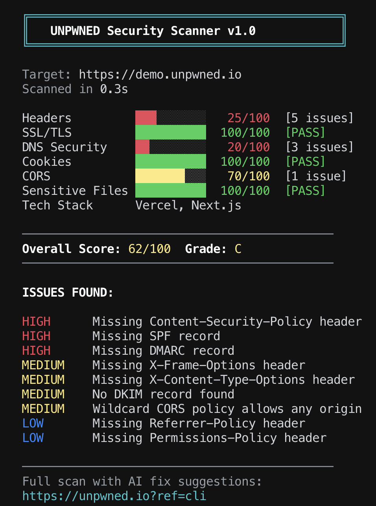

<p align="center">
  
</p>

<p align="center">
  <strong>Website security scanner in your terminal.</strong><br>
  <em>Zero config. One command. Under 1 second.</em>
</p>

<p align="center">
  <a href="https://www.npmjs.com/package/unpwned"></a>
  <a href="https://www.npmjs.com/package/unpwned"></a>
  <a href="https://github.com/razazu/unpwned-cli/stargazers"></a>
  <a href="https://github.com/razazu/unpwned-cli/blob/main/LICENSE"></a>
  <a href="https://github.com/razazu/unpwned-cli/actions"></a>
</p>

<br>

```bash
npx unpwned scan yoursite.com
```

<p align="center">
  
</p>

---

## Why?

Every website has security blind spots. Most developers don't check until it's too late.

**unpwned** runs 8 security checks in under a second, right from your terminal. No accounts, no API keys, no setup. Just paste a domain and get a score.

## What It Checks

```
  Headers         ███░░░░░░░   25/100  [5 issues]
  SSL/TLS         ██████████  100/100  [PASS]
  DNS Security    ██░░░░░░░░   20/100  [3 issues]
  Cookies         ██████████  100/100  [PASS]
  CORS            ███████░░░   70/100  [1 issue]
  Sensitive Files ██████████  100/100  [PASS]
  Tech Stack      Next.js, Vercel
  Breaches        1 breach found!
```

| Check | What It Finds |
|:------|:-------------|
| **Security Headers** | Missing CSP, HSTS, X-Frame-Options, X-Content-Type-Options, Referrer-Policy, Permissions-Policy |
| **SSL/TLS** | Expired certs, weak protocols, self-signed certificates, expiry warnings |
| **DNS Security** | Missing SPF, DMARC, DKIM, DNSSEC |
| **Cookie Security** | Missing Secure, HttpOnly, SameSite flags |
| **CORS Policy** | Wildcard origins, credential leaks, origin reflection attacks |
| **Sensitive Files** | Exposed `.env`, `.git/config`, `package.json`, `wp-config.php`, and more |
| **Tech Stack** | Detects Next.js, React, Angular, WordPress, nginx, Cloudflare, and others |
| **Data Breaches** | Known breaches from Have I Been Pwned database |

## Install

```bash
# Run directly (no install needed)
npx unpwned scan example.com

# Or install globally
npm install -g unpwned
unpwned scan example.com
```

**Requirements:** Node.js 18+

## Usage

```bash
# Basic scan
unpwned scan example.com

# JSON output (for CI/CD pipelines)
unpwned scan example.com --json

# Multiple sites
for site in site1.com site2.com site3.com; do
  npx unpwned scan $site
done
```

### Exit Codes

| Code | Meaning |
|:-----|:--------|
| `0` | Score >= 50 (passing) |
| `1` | Score < 50 (failing) |

Use this in CI to **fail builds** when security drops below threshold.

## CI/CD Integration

### GitHub Actions

The **recommended** way is the official [`unpwned-action`](https://github.com/razazu/unpwned-action) which wraps the CLI with better output, PR comments, and fail thresholds:

```yaml
name: Security Scan
on: [push, pull_request]

jobs:
  scan:
    runs-on: ubuntu-latest
    steps:
      - uses: razazu/unpwned-action@v1
        with:
          domain: yoursite.com
          fail-on: high          # or critical, medium, low, none
          comment-on-pr: true    # posts results as a PR comment
```

Or call the CLI directly:

```yaml
name: Security Audit
on:
  schedule:
    - cron: '0 9 * * 1'  # Every Monday at 9am
  push:
    branches: [main]

jobs:
  security:
    runs-on: ubuntu-latest
    steps:
      - run: npx unpwned scan yoursite.com
```

### GitLab CI

```yaml
security_scan:
  image: node:22
  script:
    - npx unpwned scan yoursite.com
  allow_failure: false
```

### Pre-commit Hook

```bash
# .husky/pre-push
npx unpwned scan yoursite.com --json | jq '.overallScore >= 70' || exit 1
```

## Scoring

Weighted average across all checks:

| Check | Weight | Why |
|:------|:-------|:----|
| Security Headers | 25% | First line of defense against XSS, clickjacking, MIME sniffing |
| SSL/TLS | 20% | Encryption in transit is non-negotiable |
| DNS Security | 20% | Email spoofing protection (SPF/DMARC/DKIM) |
| Cookie Security | 10% | Session hijacking prevention |
| CORS Policy | 10% | Cross-origin data theft protection |
| Sensitive Files | 10% | Exposed configs and credentials |
| Tech Stack | 5% | Informational (no score penalty) |

### Grades

| Grade | Score | Meaning |
|:------|:------|:--------|
| **A+** | 95-100 | Excellent security posture |
| **A** | 85-94 | Strong, minor improvements possible |
| **B** | 70-84 | Good, some gaps to address |
| **C** | 50-69 | Fair, significant improvements needed |
| **D** | 30-49 | Poor, critical issues present |
| **F** | 0-29 | Failing, immediate action required |

## How It Compares

| Tool | Headers | SSL | DNS | Cookies | CORS | Files | Breaches | Score | npx | Speed |
|:-----|:--------|:----|:----|:--------|:-----|:------|:---------|:------|:----|:------|
| **unpwned** | Yes | Yes | Yes | Yes | Yes | Yes | Yes | Yes | Yes | <1s |
| is-website-vulnerable | - | - | - | - | - | - | - | - | Yes | ~10s |
| Mozilla Observatory | Yes | - | - | - | - | - | - | Yes | Dead | - |
| Lighthouse | Partial | - | - | - | - | - | - | Yes | Yes | ~30s |
| Nuclei | - | Yes | - | - | - | Yes | - | - | - | ~5s |

## Want the Full Picture?

**unpwned** checks 8 categories from the terminal.

[**UNPWNED**](https://www.unpwned.io?ref=cli) runs **36 security scanners** with:
- AI-powered fix instructions
- PDF security reports
- Continuous monitoring
- GitHub integration
- OWASP/SOC2/GDPR compliance checks

<p align="center">
  <a href="https://www.unpwned.io?ref=cli"><strong>Get your full security report &rarr;</strong></a>
</p>

## Related

- [**UNPWNED GitHub Action**](https://github.com/razazu/unpwned-action) - Run this scan on every push or pull request
- [**UNPWNED Web**](https://www.unpwned.io?ref=cli) - Full platform with 700+ checks, AI fix prompts, and continuous monitoring
- [**slopsquat-guard**](https://github.com/razazu/slopsquat-guard) - Pre-tool-use hook for Claude Code that blocks AI-hallucinated npm/pip packages before they install. Separate project, same author.

## Contributing

Contributions are welcome! See [CONTRIBUTING.md](CONTRIBUTING.md).

```bash
git clone https://github.com/razazu/unpwned-cli.git
cd unpwned-cli
npm install
npm test        # 51 tests
npm run build
```

## License

[MIT](LICENSE) &copy; [Raz Azulay](https://github.com/razazu)

<p align="center">
  <sub>Built at <a href="https://www.unpwned.io">UNPWNED</a></sub>
</p>
